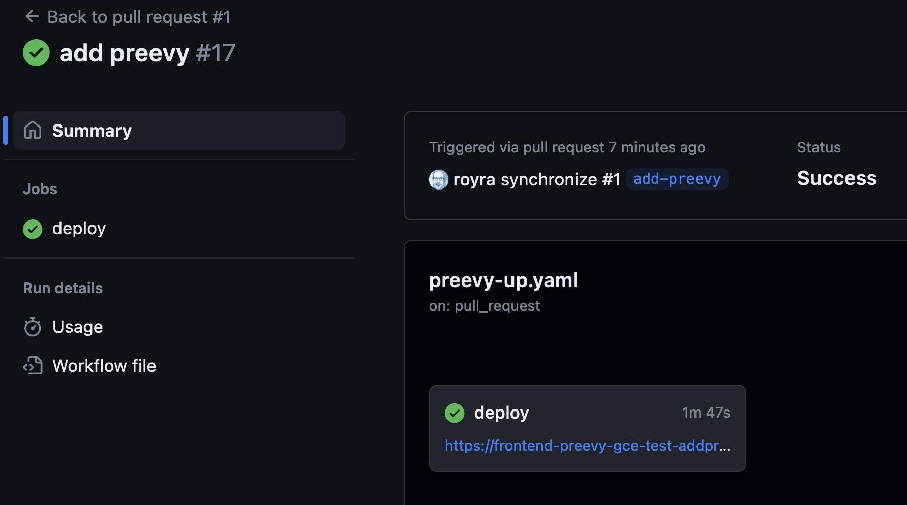
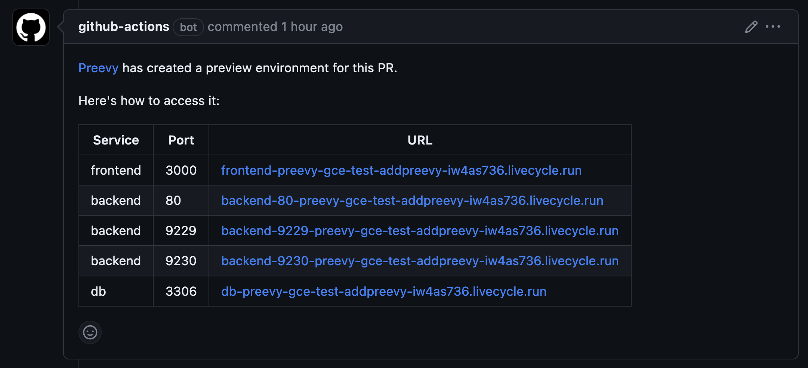
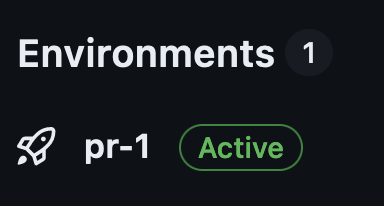
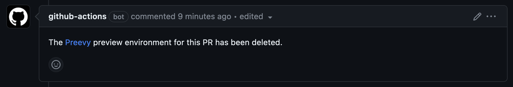

# Preevy + GitHub Actions + Google Cloud



This repo demonstrates deploying a [Preevy](https://preevy.dev) environment per pull request. It also shows integration with GitHub deployments and [environments](https://docs.github.com/en/actions/deployment/targeting-different-environments/using-environments-for-deployment).

### For every PR opened or updated:
- Preevy will provision an [environment on a Google Cloud VM](https://preevy.dev/drivers/gcp-gce) with this PR content.
- A [comment](https://github.com/livecycle/preevy/tree/main/packages/plugin-github-pr-link#readme) with the environment URLs will be posted on the PR.



- A [GH environment](https://docs.github.com/en/actions/deployment/targeting-different-environments/using-environments-for-deployment) will be created (named `pr-NNN`, where NNN is the PR number) and shown on the repo main page.



### When the PR is closed
- Preevy will delete the GCE VM.
- The PR comment will be updated to reflect the fact that the Preevy environment no longer exists.



- The GH environment will be deleted (optional, see [below](#optional-delete-gh-deployments-and-environments-on-pr-closure)).

### To use the workflow:

- Create a preevy profile using the [Preevy init](https://preevy.dev/cli-reference/init) command on your local computer.
- Create the `PREEVY_PROFILE_URL` GHA environment variable and set it to the Preevy profile URL.
- Create a GCE service account, make sure it has the proper permissions. Download its [credentials JSON file](https://github.com/googleapis/google-cloud-node#download-your-service-account-credentials-json-file) and paste it into the GHA secret `PREEVY_SA_KEY`.
- Copy the [`preevy_up.yaml`](./.github/workflows/preevy-up.yaml) and [`preevy_down.yaml`](./.github/workflows/preevy-down.yaml) GHA workflows to your repo.
- Enable the [Preevy GH PR link plugin](https://github.com/livecycle/preevy/tree/main/packages/plugin-github-pr-link#readme) by copying the [`x-preevy` section of the compose file](./compose.yaml#L72) to your Compose file.

### Optional: Delete GH deployments and environments on PR closure

To delete GH deployments and environments on PR closure, you need to setup a private GH App which will be used by the GHA flows. This is beacuse the default `GITHUB_TOKEN` [does not have enough permissions to delete those resources](https://github.com/marketplace/actions/delete-deployment-environment#how-to-obtain-the-proper-token).

To disable this feature, remove the last steps of the [`preevy_down.yaml`](./.github/workflows/preevy-down.yaml) workflow as documented in the file itself. You will have to remove the environments manually from the repo's "Environments" page.

After setting up the GH app:
- Set the GHA secret `GH_APP_PRIVATE_KEY` to the app private key.
- Set the GHA var `GH_APP_ID` to the app id.
- Install the app at the repo.

##

*The rest of this README, as well as the demo Compose app in this repo, is taken from the [`react-express-mysql` sample Compose app](https://github.com/docker/awesome-compose/tree/master/react-express-mysql) from the [Awesome Compose project](https://github.com/docker/awesome-compose) by Docker*.

## Compose sample application

### Use with Docker Development Environments

You can open this sample in the Dev Environments feature of Docker Desktop version 4.12 or later.

[Open in Docker Dev Environments ](https://open.docker.com/dashboard/dev-envs?url=https://github.com/docker/awesome-compose/tree/master/react-express-mysql)

### React application with a NodeJS backend and a MySQL database

Project structure:
```
.
├── backend
│   ├── Dockerfile
│   ...
├── db
│   └── password.txt
├── compose.yaml
├── frontend
│   ├── ...
│   └── Dockerfile
└── README.md
```

[_compose.yaml_](compose.yaml)
```
services:
  backend:
    build: backend
    ports:
      - 80:80
      - 9229:9229
      - 9230:9230
    ...
  db:
    # We use a mariadb image which supports both amd64 & arm64 architecture
    image: mariadb:10.6.4-focal
    # If you really want to use MySQL, uncomment the following line
    #image: mysql:8.0.27
    ...
  frontend:
    build: frontend
    ports:
    - 3000:3000
    ...
```
The compose file defines an application with three services `frontend`, `backend` and `db`.
When deploying the application, docker compose maps port 3000 of the frontend service container to port 3000 of the host as specified in the file.
Make sure port 3000 on the host is not already being in use.

> ℹ️ **_INFO_**
> For compatibility purpose between `AMD64` and `ARM64` architecture, we use a MariaDB as database instead of MySQL.
> You still can use the MySQL image by uncommenting the following line in the Compose file
> `#image: mysql:8.0.27`

## Deploy with docker compose

```
$ docker compose up -d
Creating network "react-express-mysql_default" with the default driver
Building backend
Step 1/16 : FROM node:10
 ---> aa6432763c11
...
Successfully tagged react-express-mysql_frontend:latest
WARNING: Image for service frontend was built because it did not already exist. To rebuild this image you must use `docker-compose build` or `docker-compose up --build`.
Creating react-express-mysql_db_1 ... done
Creating react-express-mysql_backend_1 ... done
Creating react-express-mysql_frontend_1 ... done
```

## Expected result

Listing containers must show containers running and the port mapping as below:
```
$ docker ps
CONTAINER ID        IMAGE                          COMMAND                  CREATED             STATUS                   PORTS                                                  NAMES
f3e1183e709e        react-express-mysql_frontend   "docker-entrypoint.s…"   8 minutes ago       Up 8 minutes             0.0.0.0:3000->3000/tcp                                 react-express-mysql_frontend_1
9422da53da76        react-express-mysql_backend    "docker-entrypoint.s…"   8 minutes ago       Up 8 minutes (healthy)   0.0.0.0:80->80/tcp, 0.0.0.0:9229-9230->9229-9230/tcp   react-express-mysql_backend_1
a434bce6d2be        mysql:8.0.19                   "docker-entrypoint.s…"   8 minutes ago       Up 8 minutes             3306/tcp, 33060/tcp                                    react-express-mysql_db_1
```

After the application starts, navigate to `http://localhost:3000` in your web browser.


The backend service container has the port 80 mapped to 80 on the host.
```
$ curl localhost:80
{"message":"Hello from MySQL 8.0.19"}
```

Stop and remove the containers
```
$ docker compose down
Stopping react-express-mysql_frontend_1 ... done
Stopping react-express-mysql_backend_1  ... done
Stopping react-express-mysql_db_1       ... done
Removing react-express-mysql_frontend_1 ... done
Removing react-express-mysql_backend_1  ... done
Removing react-express-mysql_db_1       ... done
Removing network react-express-mysql_default

```
